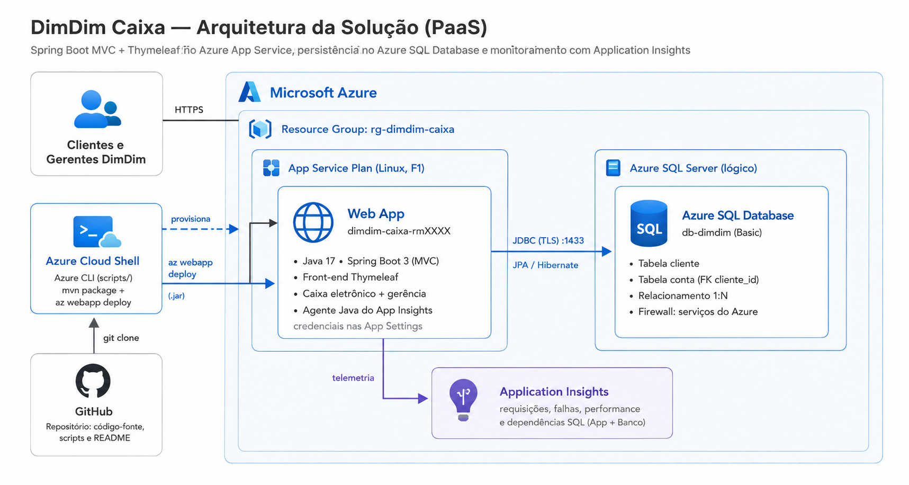
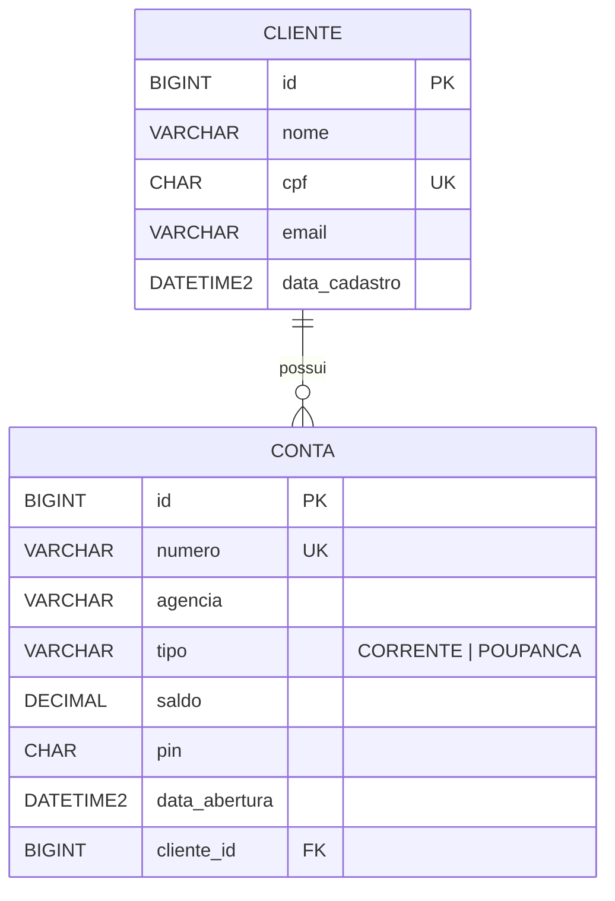

# 💛 DimDim Caixa — Web App + Azure SQL Database

Projeto do **2º Checkpoint (2º semestre)** da disciplina *DevOps Tools & Cloud Computing* — FIAP.

> Grupo: **ELV** · Vídeo de demonstração: **[LINK_DO_VIDEO](https://youtube.com/)**

## 📑 Sumário

- [📌 Descrição da solução](#-descrição-da-solução)
- [🏗️ Arquitetura](#️-arquitetura)
- [🗄️ Banco de dados](#️-banco-de-dados)
- [🧰 Tecnologias](#-tecnologias)
- [📁 Estrutura do repositório](#-estrutura-do-repositório)
- [🛤️ Rotas da aplicação](#️-rotas-da-aplicação)
- [🚀 How to — implantação completa na nuvem](#-how-to--implantação-completa-na-nuvem)
- [🔐 Segurança](#-segurança)
- [🫂 Integrantes](#-integrantes)

---

## 📌 Descrição da solução

A **DimDim** é um banco com mais de 1 milhão de correntistas e **2 mil caixas eletrônicos**, que sofre com um parque tecnológico obsoleto, perda de desempenho no banco de dados e queda de conexão dos clientes. Antes de levar suas aplicações oficialmente para a nuvem, a diretoria pediu à nossa consultoria um **teste em ambiente de nuvem**, usando apenas serviços **PaaS** (sem gerenciar servidores).

Desenvolvemos o **DimDim Caixa**, uma aplicação web em **Java 17 + Spring Boot (MVC) + Thymeleaf** com duas áreas:

| Área | Quem usa | O que faz |
|---|---|---|
| 🏧 **Caixa Eletrônico** | Cliente | Entra com número da conta + PIN e faz **saque**, **depósito** e **consulta de saldo** numa tela que simula um caixa (com teclado numérico) |
| 🏢 **Gerência (back-office)** | Agência | **CRUD completo de Clientes** e **CRUD completo de Contas** (abrir, consultar, alterar e encerrar) |

Toda a solução roda na Microsoft Azure:

- **Azure App Service (Web App)** hospeda a aplicação (`.jar`, Java 17, Linux)
- **Azure SQL Database** guarda os dados (PaaS, não containerizado)
- **Application Insights** monitora a aplicação e as chamadas ao banco (dependências SQL)
- **Azure CLI + az webapp deploy** automatizam a criação dos recursos e o deploy

---

## 🏗️ Arquitetura



**Fluxo:**
1. O script `scripts/deploy-dimdim.sh` é executado no **Azure Cloud Shell** e cria todos os recursos (Resource Group, SQL Server, Database, firewall, Application Insights, App Service Plan e Web App) e configura as variáveis de ambiente do Web App.
2. No próprio Cloud Shell, o projeto é clonado do **GitHub**, compilado com **Maven** (`mvn clean package`) e publicado no **Web App** com `az webapp deploy` (arquivo `.jar`).
3. O usuário acessa o Web App por **HTTPS**; a aplicação grava e lê os dados no **Azure SQL Database** via JDBC (TLS, porta 1433).
4. O agente Java do **Application Insights** coleta requisições, tempos de resposta, falhas e as **consultas SQL** feitas ao banco.

---

## 🗄️ Banco de dados

Duas tabelas com relacionamento **1:N** (um cliente possui várias contas). O DDL está em [`scripts/ddl.sql`](scripts/ddl.sql).



> Ao excluir um cliente, as contas dele são removidas em cascata (`ON DELETE CASCADE`).

---

## 🧰 Tecnologias

- Java 17, Spring Boot 3.3, Spring MVC, Spring Data JPA, Bean Validation
- Thymeleaf + Bootstrap 5 (front-end renderizado no servidor — **não é API**)
- Driver `mssql-jdbc` (Azure SQL Database)
- Azure App Service (Linux, F1), Azure SQL Database (Basic), Application Insights
- Azure CLI (Cloud Shell) e `az webapp deploy`

---

## 📁 Estrutura do repositório

```
ELV-DIMDIM-CAIXA/
├── docs/
│   ├── arquitetura.png          # desenho da arquitetura
│   └── arquitetura.svg
├── scripts/
│   ├── deploy-dimdim.sh         # Azure CLI: cria os recursos + build + deploy
│   └── ddl.sql                  # DDL das tabelas
├── src/main/java/com/dimdim/caixa/
│   ├── controller/              # Home, Cliente, Conta, Caixa
│   ├── model/                   # Cliente, Conta, TipoConta
│   ├── repository/              # Spring Data JPA
│   └── service/                 # regras de negócio (saque, depósito, validações)
├── src/main/resources/
│   ├── application.properties   # lê credenciais de variáveis de ambiente
│   └── templates/               # telas Thymeleaf
└── pom.xml
```

---

## 🛤️ Rotas da aplicação

| Método | Rota | Descrição |
|---|---|---|
| GET | `/` | Página inicial |
| GET | `/clientes` | Lista clientes |
| GET | `/clientes/novo` | Formulário de novo cliente |
| POST | `/clientes` | **Create** cliente |
| GET | `/clientes/{id}` | **Read** cliente (com as contas dele) |
| GET | `/clientes/{id}/editar` | Formulário de edição |
| POST | `/clientes/{id}` | **Update** cliente |
| POST | `/clientes/{id}/excluir` | **Delete** cliente |
| GET | `/contas` | Lista contas |
| GET | `/contas/nova` | Formulário de abertura de conta |
| POST | `/contas` | **Create** conta |
| GET | `/contas/{id}` | **Read** conta |
| GET | `/contas/{id}/editar` | Formulário de edição |
| POST | `/contas/{id}` | **Update** conta |
| POST | `/contas/{id}/excluir` | **Delete** conta |
| GET | `/caixa` | Tela de login do caixa (conta + PIN) |
| POST | `/caixa/entrar` | Autentica no caixa |
| GET | `/caixa/menu` | Saldo e operações |
| POST | `/caixa/operacao` | Saque ou depósito (atualiza o saldo) |
| GET | `/caixa/sair` | Encerra a sessão do caixa |

> Como a solução tem **front-end** (não é uma API REST), não há JSON de GET/POST/PUT/DELETE: todas as operações são feitas pelas telas.

---

## 🚀 How to — implantação completa na nuvem

### Pré-requisitos

- Conta na **Azure** com permissão para criar recursos, numa região permitida pela Policy da FIAP: `southcentralus`, `brazilsouth`, `chilecentral`, `mexicocentral` ou `southafricanorth`
- Acesso ao **Azure Cloud Shell** (Bash) em https://shell.azure.com

### 1. Abrir o Cloud Shell e conferir a assinatura

```bash
az account show --query name -o tsv
```

### 2. Ajustar as variáveis

No início do `scripts/deploy-dimdim.sh` ficam os nomes dos recursos. Ajuste o RM e a região, se necessário:

```bash
RESOURCE_GROUP_NAME="rg-dimdim"
SQL_SERVER_NAME="sql-server-dimdim-rm561713-southafricanorth"
SQL_DB_NAME="db-dimdim"
WEBAPP_NAME="dimdim-caixa-rm561713"
APP_SERVICE_PLAN="dimdim-caixa"
LOCATION="southafricanorth"
RUNTIME="JAVA:17-java17"
APP_INSIGHTS_NAME="ai-dimdim-caixa"
```

### 3. Executar o script

Cole os blocos do `scripts/deploy-dimdim.sh` no Cloud Shell, na ordem. O script:

1. Cria o **Resource Group**.
2. Registra o provider `Microsoft.Sql` e cria o **Azure SQL Server** e o banco **db-dimdim** (Basic).
3. Cria a regra de **firewall** do SQL Server.
4. Registra os providers `Microsoft.Web`, `Microsoft.Insights` e `Microsoft.OperationalInsights` e instala a extensão `application-insights`.
5. Cria o **Application Insights**, o **App Service Plan** (F1, Linux) e o **Web App** (Java 17).
6. Clona o projeto do GitHub e compila com `mvn clean package`.
7. Configura as **App Settings** do Web App: agente do Application Insights e `SPRING_DATASOURCE_URL`, `SPRING_DATASOURCE_USERNAME` e `SPRING_DATASOURCE_PASSWORD`.
8. Conecta o Web App ao Application Insights.
9. Faz o deploy do `.jar` com `az webapp deploy`.

### 4. Criar as tabelas

Depois que o banco estiver criado: **Portal Azure → SQL databases → db-dimdim → Query editor**, login com **SQL authentication** (usuário `user-dimdim`), cole o conteúdo de [`scripts/ddl.sql`](scripts/ddl.sql) e clique em **Run**.

### 5. Acessar a aplicação

```
https://dimdim-caixa-rm561713.azurewebsites.net
```

> No plano F1 a primeira abertura pode levar até 1 minuto (o app "acorda").

### 6. Testar o CRUD e conferir a persistência no banco

Abra o **Query editor** do `db-dimdim` e rode `SELECT * FROM dbo.cliente;` e `SELECT * FROM dbo.conta;` **depois de cada operação**:

| # | Operação na aplicação | Conferir no banco |
|---|---|---|
| 1 | **Clientes → Novo cliente**: Maria da Silva, CPF 12345678901, maria@email.com | `SELECT * FROM dbo.cliente;` |
| 2 | **Clientes → Editar**: trocar o email | `SELECT * FROM dbo.cliente;` |
| 3 | **Contas → Abrir conta**: titular Maria, agência 0001, conta 12345, Corrente, PIN 1234, saldo 500 | `SELECT * FROM dbo.conta;` |
| 4 | **Contas → Editar**: mudar para Poupança | `SELECT * FROM dbo.conta;` |
| 5 | **Caixa Eletrônico**: conta 12345 + PIN 1234 → **Depósito** de 200 | saldo = 700,00 |
| 6 | **Caixa Eletrônico** → **Saque** de 50 | saldo = 650,00 |
| 7 | **Clientes → Detalhes**: ver as contas do cliente (relacionamento) | SELECT com `JOIN` |
| 8 | **Contas → Encerrar** | a linha some de `dbo.conta` |
| 9 | **Clientes → Excluir** | a linha some de `dbo.cliente` (e as contas, em cascata) |

### 7. Ver o monitoramento no Application Insights

No portal: **Application Insights → ai-dimdim-caixa**

- **Live metrics**: requisições acontecendo em tempo real enquanto você usa o app
- **Application map**: Web App → banco `db-dimdim` (dependência SQL)
- **Performance**: tempo de cada rota (`POST /clientes`, `POST /caixa/operacao`...) e, na aba Dependencies, as chamadas SQL
- **Search**: cada requisição com as consultas SQL executadas
- **Failures**: erros, se houver

> Os dados podem levar de 2 a 5 minutos para aparecer.

---

## 🔐 Segurança

- O código da aplicação não tem credenciais: o `application.properties` lê `SPRING_DATASOURCE_*` de variáveis de ambiente, configuradas nas **App Settings** do Web App.
- A conexão com o banco é criptografada (`encrypt=true`, porta 1433).
- O firewall do SQL Server usa a regra `liberaGeral` (todos os IPs) apenas para fins de estudo; em produção, a liberação seria restrita aos serviços do Azure e a IPs específicos.

---

## 🫂 Integrantes

| RM | Nome |
|---|---|
| RM561713 | Eduardo Batista Locaspi |
| RM565698 | Liana Lyumi Morisita Fujisima |
| RM561833 | Victor Alves Lopes |
